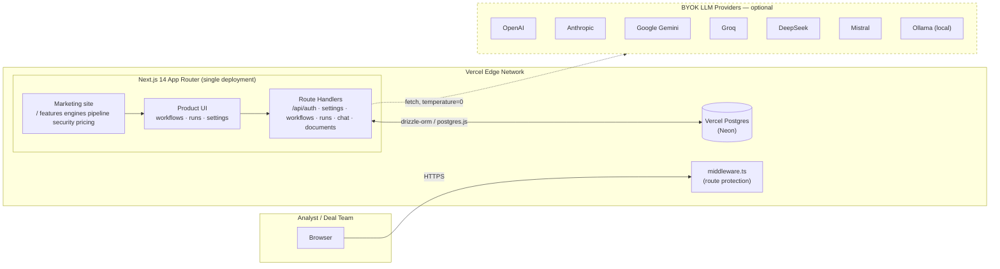
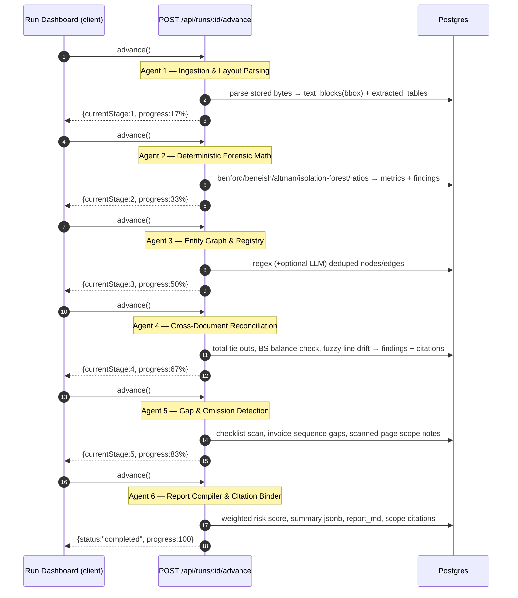
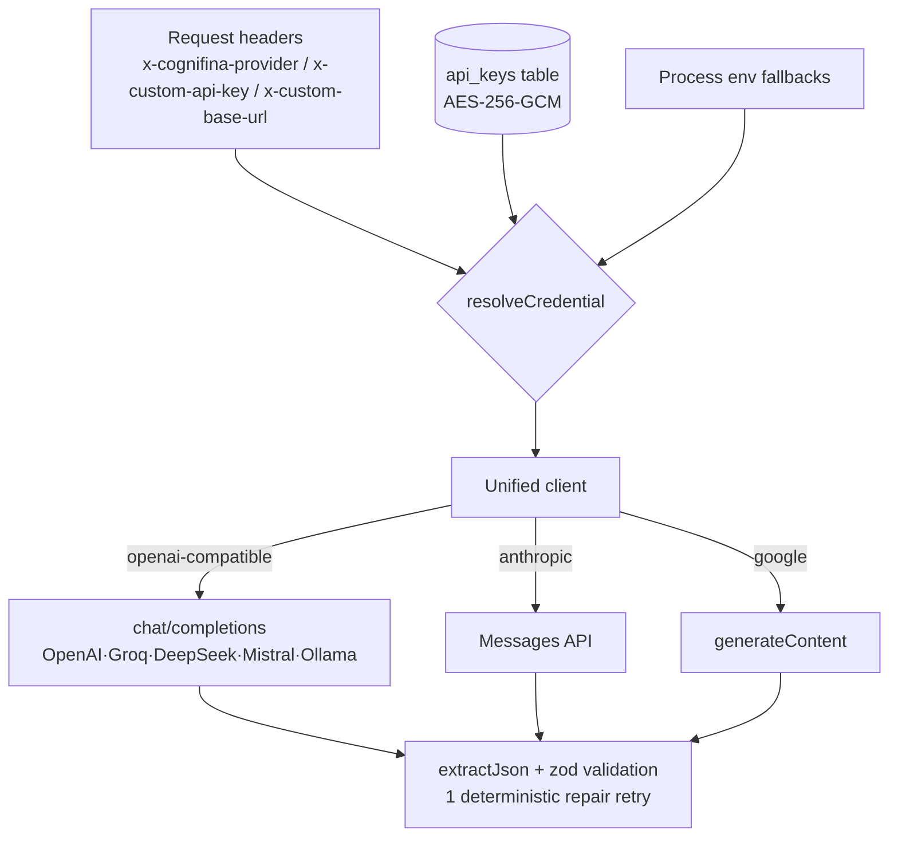

# Cognifina AI — Architecture

> Deterministic forensic & compliance meta-harness. "Math before Models": hard statistics always precede probabilistic inference, and every artifact is reproducible.

---

## 1. System context



Everything ships as **one Next.js application**. The only external dependency is Postgres. LLM providers are strictly optional: the deterministic engines and the extractive-chat fallback work with **zero** keys configured.

---

## 2. Execution pipeline (serverless stage machine)

Long-running workers don't exist on serverless, so the 6-agent pipeline is a **stage machine advanced by the client**: each `POST /api/runs/:id/advance` executes exactly one agent to completion and returns progress. The run dashboard drives this loop automatically.



**Failure semantics:** any agent exception marks the run `failed`, records the message with the stage name, and stops advancement — completed stages are preserved.

---

## 3. Data model

```mermaid
erDiagram
    users ||--o{ api_keys : "BYOK vault"
    users ||--o{ runs : owns
    runs ||--o{ documents : ingests
    runs ||--o{ text_blocks : extracts
    runs ||--o{ extracted_tables : normalizes
    runs ||--o{ findings : raises
    runs ||--o{ citations : binds
    runs ||--o{ forensic_metrics : computes
    runs ||--o{ entity_nodes : resolves
    runs ||--o{ entity_edges : relates
    runs ||--o{ chat_messages : logs
    documents ||--o{ text_blocks : contains
    documents ||--o{ extracted_tables : contains
    findings ||--o{ citations : evidenced-by

    users {
        uuid id PK
        text email UK
        text password_hash "scrypt"
    }
    api_keys {
        uuid id PK
        uuid user_id FK
        text provider "openai|anthropic|google|groq|deepseek|mistral|ollama"
        text encrypted_key "AES-256-GCM"
        text key_hint "••••last4"
    }
    runs {
        uuid id PK
        text workflow_id "one of 25 definitions"
        int current_stage "0..6"
        text status "queued|running|completed|failed"
        int risk_score "0..100 weighted"
        jsonb summary
        text report_md
        jsonb enabled_checks
    }
    documents {
        uuid id PK
        bytea bytes "original file ≤25MB"
        jsonb scanned_pages
        text sha256
    }
    text_blocks {
        int page_number
        jsonb bbox "[x0,y0,x1,y1]"
        text hash "sha256(text)"
    }
    extracted_tables {
        text statement_type "balance_sheet|profit_loss|cash_flow|trial_balance|journal|other"
        jsonb rows
        jsonb numeric_rows
    }
    findings {
        text ref "FINDING-001…"
        severity "critical|high|medium|low|info"
        int weight "25/15/8/3/1"
    }
    citations {
        text raw_excerpt
        jsonb bbox
        real confidence
    }
    forensic_metrics {
        text key "benford_first_digit | beneish_m_score | …"
        jsonb value
    }
```

---

## 4. Forensic engine internals

All engines are pure TypeScript in `src/lib/forensic/` — no native binaries, no ML runtime, deterministic across platforms.

### Benford (`benford.ts`)

- Populations: leading digits of positive finite amounts; first digit needs ≥100 values, first-two ≥300.
- `P(d)=log10(1+1/d)`; χ² = Σ(Oᵢ−Eᵢ)²/Eᵢ with dof=k−1; p-value via a hand-rolled regularized incomplete gamma (`stats.ts gammaQ`).
- Per-digit Z-scores `(p̂−p)/√(p(1−p)/n)` pinpoint which digits carry excess weight; Nigrini MAD bands grade conformity (close/acceptable/marginal/nonconforming).

### Beneish (`beneish.ts`)

- DSRI, GMI, AQI, SGI, DEPI, SGAI, LVGI, TATA computed from two consecutive periods with alias-tolerant field mapping.
- Ships both coefficient sets:
  - Platform spec (default): `M = −4.84 + .920·DSRI + .528·GMI + .404·AQI + .892·SGI + .115·DEPI − .172·SGAI + 4.037·TATA + .0327·LVGI`
  - Canonical 1999 paper: `TATA=4.679, LVGI=−0.327`
- Flag when `M > −1.78`; upward-driving indices reported alongside.

### Altman (`altman.ts`)

- Private-firm model Z′ = 6.56X₁+3.26X₂+6.72X₃+1.05X₄; zones Safe >2.6 / Grey 1.23–2.6 / Distress <1.23 (public-manufacturing Z also implemented).

### Isolation Forest (`isolationForest.ts`)

- 100 trees, subsample ψ=256, seeded Mulberry32 PRNG → identical anomalies on every run.
- Features per journal entry: log-amount, absolute amount, round-sum flags (×100/×1000), weekend posting, off-hours posting, account frequency.
- Score s(x)=2^(−E[h]/c(n)); threshold at the (1−contamination) quantile; top hits carry human-readable reasons.

### Ratios (`ratios.ts`)

- Current/quick, debt/equity, gross/net margin, interest coverage per period; coefficient-of-variation volatility flags across ≥3 periods against per-ratio ceilings.

---

## 5. Extraction pipeline

| Source           | Path                                                                                                                                          |
| ---------------- | --------------------------------------------------------------------------------------------------------------------------------------------- |
| PDF (text layer) | `unpdf` (bundled pdf.js, serverless-safe) → per-line grouping of glyph items into blocks **with bounding boxes** → sha256 per block |
| PDF tables       | `pdfTables.ts` — numeric-token x-grid clustering over consecutive candidate lines; dominant column-count mode; quantized column slots      |
| XLSX/XLS         | SheetJS → sheet matrices → header detection → numeric matrix                                                                               |
| CSV              | Hand-rolled RFC-4180-ish parser (quotes, escaped quotes, CRLF)                                                                                |
| DOCX             | mammoth raw text → virtual pages (35 paragraphs/page)                                                                                        |
| TXT/MD           | Line-windowed pages                                                                                                                           |

Scanned pages (no text layer ≥40 chars) are recorded on the document and surfaced as an explicit gap finding — coverage is never silently partial.

---

## 6. BYOK provider layer



- **temperature = 0 everywhere**; structured outputs validated by Zod schemas.
- Resolution order: headers → user vault → env → none (engines still run; LLM passes degrade gracefully).
- Vault: AES-256-GCM, key derived from `ENCRYPTION_KEY` via scrypt; only masked hints ever leave the server.

---

## 7. Risk score

`score = min(100, Σ severity weights)` with weights critical 25 / high 15 / medium 8 / low 3 / info 1; bands Low <25 ≤ Moderate <50 ≤ Elevated <75 ≤ Severe. Monotonic, explainable, stable across reruns.

## 8. Grounded chat retrieval

Deterministic TF-IDF lexical scoring over up to 3,000 blocks (English stopword list, token len >2). Top-8 segments form the evidence pack; computed metrics are prepended as authoritative context. With a provider: strict JSON answer + segment citations + `sufficientEvidence` gate. Without one: extractive fallback quoting top passages verbatim with citations, or an explicit refusal.

---

## 9. Tech stack & why (versions pinned in `package.json`)

| Layer        | Choice                                            | Version          | Why                                                                                                                                                                       |
| ------------ | ------------------------------------------------- | ---------------- | ------------------------------------------------------------------------------------------------------------------------------------------------------------------------- |
| Framework    | Next.js (App Router)                              | **14.2.5** | One deployable for marketing + app + API; route handlers cover the backend without a second service; first-class Vercel fit. React**18.3.1** pinned (Next 14 peer). |
| Language     | TypeScript (strict)                               | ^5.5             | The whole product*is* typed contracts between Pydantic-equivalent DTOs (`lib/types.ts`) and SQL rows; strict mode caught real integration bugs pre-build.             |
| Styling      | Tailwind CSS                                      | ^3.4             | Token-driven design system in`globals.css` (materials, type scale) compiled away; no CSS-in-JS runtime cost.                                                            |
| Motion       | framer-motion                                     | ^11.2            | Spring physics with interruptible layout animations (active-nav pill),`useReducedMotion` respected throughout — Apple-style fluidity.                                  |
| Graph        | @xyflow/react                                     | ^12.3            | Purpose-built node-link canvas (entity ownership maps): drag, zoom, minimap, custom nodes out of the box.                                                                 |
| Charts       | recharts                                          | ^2.12            | Declarative SVG bars for observed-vs-Benford distributions; small API surface.                                                                                            |
| Icons        | lucide-react                                      | ^0.395           | Consistent 24px grid, tree-shakeable.                                                                                                                                     |
| ORM          | drizzle-orm + postgres.js                         | 0.36.4 / ^3.4    | Typed schema-in-TS, zero-codegen, edge/serverless-friendly driver with`prepare:false` for pooled providers (Neon/Vercel). drizzle-kit **0.28.1** for push/studio. |
| DB           | PostgreSQL 16 (Vercel Postgres/Neon/local Docker) | —               | JSONB for structured artifacts (bboxes, metric payloads), bytea for stored source files, cascading deletes per run.                                                       |
| PDF          | unpdf                                             | ^0.12            | Wraps a serverless-safe pdf.js build: no canvas/native deps, works in Lambda-scale limits, exposes glyph transforms needed for citation bboxes.                           |
| Spreadsheets | SheetJS (xlsx)                                    | ^0.18.5          | Battle-tested multi-sheet parsing incl. legacy .xls.                                                                                                                      |
| DOCX         | mammoth                                           | ^1.8             | Pure-JS docx→text; no LibreOffice requirement.                                                                                                                           |
| Validation   | zod                                               | ^3.23            | Runtime contracts for every mutating endpoint and every LLM structured output.                                                                                            |
| Crypto       | node:crypto                                       | built-in         | scrypt password hashing, HMAC-signed session cookies, AES-256-GCM vault — no third-party auth service, no key ever leaves your infra.                                    |

### Deliberate omissions

- **No Celery/Redis** — the stage-machine pattern removes queue infrastructure entirely on serverless; swapping in ARQ later only touches `orchestrator.advanceRun`.
- **No scipy/sklearn/pandas** — chi-square p-values, isolation forests and matrix handling are implemented natively (~300 LOC), cutting cold starts and the 250 MB serverless budget to near-zero.
- **No tesseract binary** — incompatible with Vercel functions; scanned-page detection keeps coverage honest instead.

---

## 10. Security model summary

1. Passwords: scrypt + per-user salt, constant-time compare.
2. Sessions: HTTP-only cookie, HMAC-SHA256 signed payload, 30-day TTL, `secure` in production.
3. BYOK vault: AES-256-GCM (scrypt-derived key); masked hints only in reads; test-before-save flow.
4. Authorization: every `/api/runs/*`, `/api/documents/*`, `/api/settings/*` query is user-scoped (`user_id` join/check).
5. Middleware gates `/workflows`, `/runs`, `/settings`; APIs independently enforce auth (defense in depth).
6. No secret is ever logged; provider calls go browser-independent server-side.
